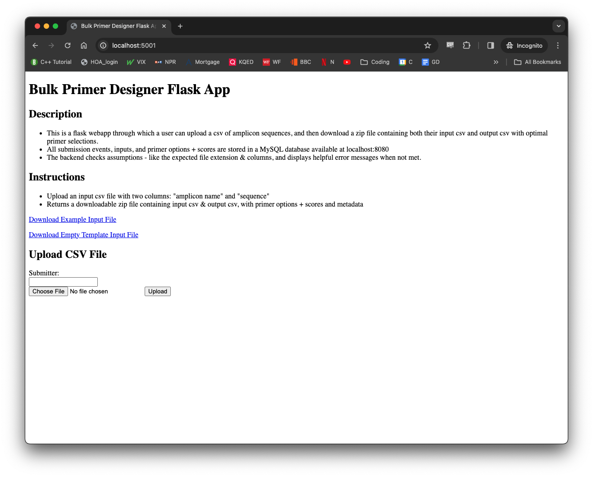
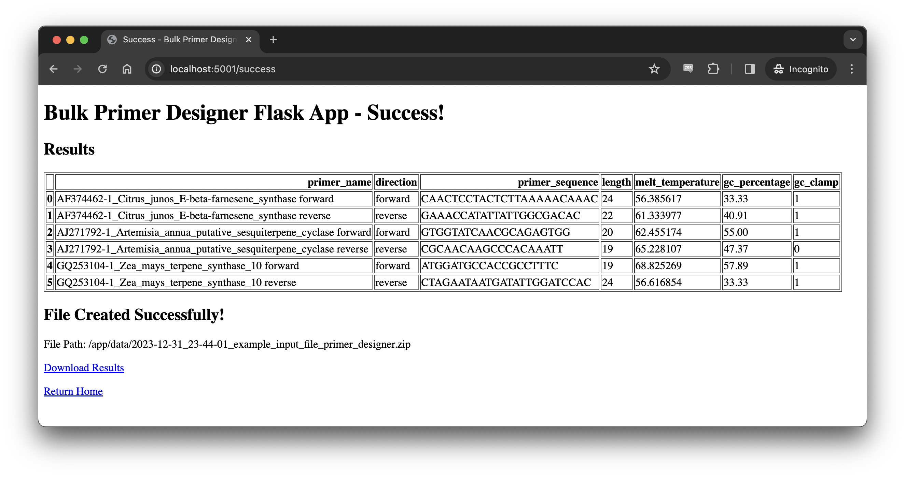
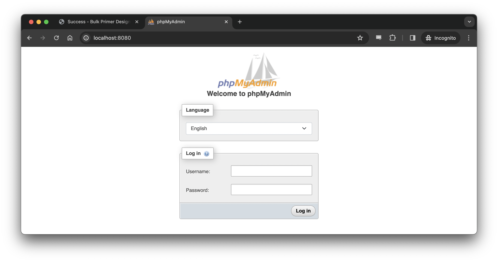
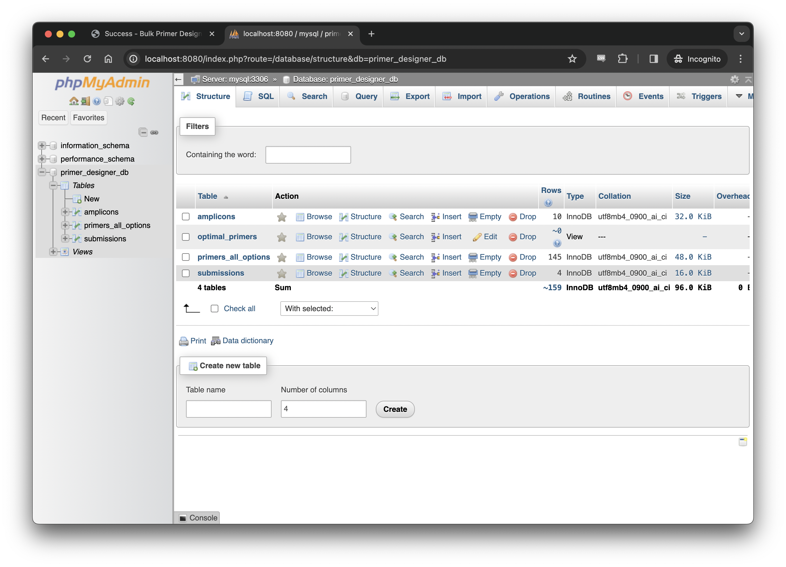
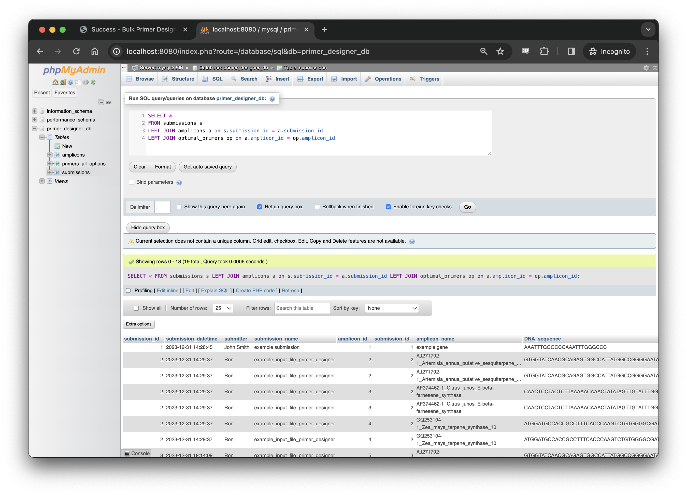
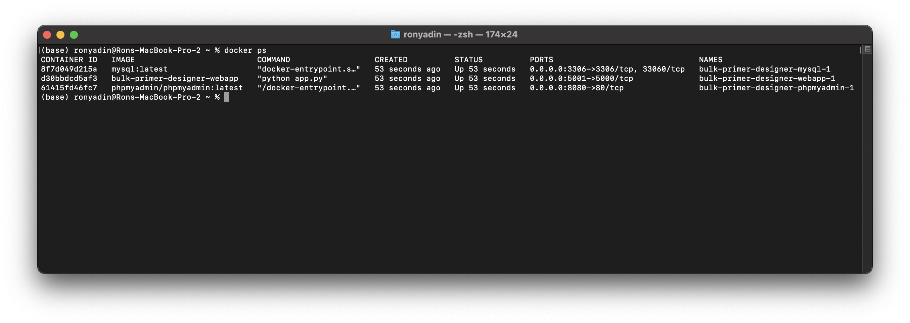

# Primer Designer for PCR DNA Amplification with MySQL Database
## Overview
- A containerized, full-stack webapp that designs oligonucleotide primers for PCR amplification of a list input of amplicons.  

- There is a user interface webpage where a user can upload an input csv file, then view & download the results output csvs. Additionally, the inputs, submission events, scored primer options, and optimal primers subset are tracked in a MySQL relational database. This database can be accessed through a second database admin webpage, where the database can be managed and queried with SQL. 
  
- This app accepts a two-column input csv (with header columns "amplicon name" & "sequence"), and returns a zip file containing the input file, the scored list of all primer options considered, and the subsetted list of top-ranked optimal primers for each amplicon.

### Skills Highlighted
- Tech stack: docker-compose & Dockerfile, Flask (python, pandas, Biopython, HTML, jinja, session), MySQL (database development with DDL, loading with mysql-connector, and querying with SQL)
- Molecular biology: Translating complex biological formula ([Modified Breslauer Melting Temperature](http://biotools.nubic.northwestern.edu/OligoCalc2.01.html)) into code, forward & reverse primer generation through multi-criteria decision analysis (MCDA) considering Tm, GC%, and presence or absence of a GC clamp
- Best practices: containerization & dependency management, secrets management (.env file), input validation (try/except), error handling (error.html with helpful error messages), comments & documentation (docstrings, inline comments, detailed README.md)
___
## Project File Structure
```
/csv-xform-flask-mysql-app
|-- data (for example files & output zip files)
|   |-- (mysql_data) - not in repo, but automatically generated upon initialization
|   |-- empty_template_input_file.csv
|   |-- example_input_file.csv
|-- readme_resources
|   |-- primer-designer-nominal-docker-ps.png
|   |-- primer-designer-phpMyAdmin-database.png
|   |-- primer-designer-phpMyAdmin-home.png
|   |-- primer-designer-phpMyAdmin-query.png
|   |-- primer-designer-webapp-home.png
|   |-- primer-designer-webapp-results.png
|-- webapp
|   |-- templates
|       |-- error.html
|       |-- index.html
|       |-- success.html
|   |-- app.py
|   |-- Dockerfile
|   |-- load_database.py
|   |-- primer_designer.py
|   |-- requirements.txt
|-- .gitignore
|-- docker-compose.yml
|-- env.txt (MUST BE CHANGED TO .ENV LOCALLY, REPLACE DEFAULT VALUES)
|-- init.sql
|-- LICENSE
|-- README.md
```
___
## Requirements
1. Supported architectures: ```amd64```,  ```arm64v8```
1. Ensure Docker is installed - follow [the install instructions found here](https://docs.docker.com/desktop/) to install it
    - Docker Desktop recommended for MacOS & Windows. Docker Enginge and Docker Compose installed on 64-bit linux should also work (but as of yet, not tested). 
## Installation
1. Clone or download this repo to copy the required files & file structure locally
    - Open a terminal window and run: ```git clone --depth 1 https://github.com/ron-yadin/bulk-primer-designer.git```
    - Alternatively, click green ```Code``` button >  ```Download ZIP```, then unzip the file locally
1. Convert the ```env.txt``` file into a configured ```.env``` file locally
    - rename the ```env.txt``` template file as  ```.env```, and replace the default user name, passwords, database name, and flask secret key with custom secret values
    - this is a security best practice to avoid publication of sensitive login information - the ```.env``` is in the ```.gitignore``` file, and will not be included in version control
## Usage
1. Ensure Docker daemon is running locally (by starting Docker Desktop, for example)
1. Open a terminal window
1. Navigate to the project folder ```cd local/path/to/bulk-primer-designer```    
    - update the path to match project folder location in local file system 
1. Run the command: ```docker-compose up --build```
    - optionally, add the ```-d``` flag to run in "detached mode" (in the background)
1. Open a web browser and visit ```localhost:5001``` for the webapp user interface
    - There will be a description, instructions, links to download an example input file & empty input file template, and a form to submit an input csv and submitter name. 

    - Upon submission and successful execution, a redirect to the successful results display page will occur, with a link to download the output zip file

1. Open a web browser and visit ```localhost:8080``` for the MySQL database administration interface
    - use the user name (```MYSQL_USER```) & password (```MYSQL_PASSWORD```) configured in the ```.env``` file to sign into the MySQL admin dashboard


    - To inspect & query tables, click the database name (```MYSQL_DATABASE```) in the left panel. Tables will be shown and "SQL" option in the top navigation bar will open a box to enter queries
        - example SQL queries to run: 
        ```
        SELECT *
        FROM submissions s
        LEFT JOIN amplicons a on s.submission_id = a.submission_id
        LEFT JOIN optimal_primers op on a.amplicon_id = op.amplicon_id
        ```
        ```
        SELECT *
        FROM submissions s
        LEFT JOIN amplicons a on s.submission_id = a.submission_id
        LEFT JOIN primers_all_options pao on a.amplicon_id = pao.amplicon_id
        ```


1. To stop the app: 
    - if running in "streaming mode" (without the "detached mode" flag ```-d```), press ```Ctrl+C```, followed by ```docker-compose down -v```. 
    - If running in "detached mode", simply run ```docker-compose down -v```. 
    - Note: the data in the MySQL database persists between container restarts in a locally-mounted docker volume, automatically generating the /data/mysql_data directory
        - deleting the data/mysql_data/ directory will delete the data and reset the database upon re-initialization. 
## Notes
1. In addition to containing the data definition language (DDL) that configures the MySQL data model, the ```init.sql``` file includes the insertion of a few rows of example data upon initialization, to ensure the tables get created even in the absence of any user action. 
    - These lines can be removed if no example data is desired.
1. Successful submission and execution of the app generates a link to download the results zipfile, which is also saved to the /data/ directory. 
    - This results zip file contains the input file, the scored list of all primer options considered, and the subsetted list of top-ranked optimal primers for each amplicon
    - The filename is YYYY-MM-DD_HH:MM:SS_\<input_filename\>.zip 
1. All timestamps are localized to California time.
1. Input amplicon sequences are cleaned up after import - so "sequence" values are not case sensitive, and newline characters ("\n"), return characters ("\r"), and spaces will be removed (i.e. copy+paste from fasta file is OK)
## Troubleshooting
1. If deployment attempted on non-supported system architecture, might see an error like: ```no matching manifest for <non-supported/system/architecture> in the manifest list entries```
1. If issues arise in connecting to or executing actions with either user webapp or MySQL admin webapp, examine the container status & docker logs
    - In a terminal window, run ```docker ps```. There should be 3 containers running

    - If running in "detached mode", run ```docker logs <container id>``` for each container - examine if any ```exited with error code #```. This would indicate an issue, and provide information for further troubleshooting.
    - If running in "streaming mode" (not detached), simply examine the logs in the terminal window 