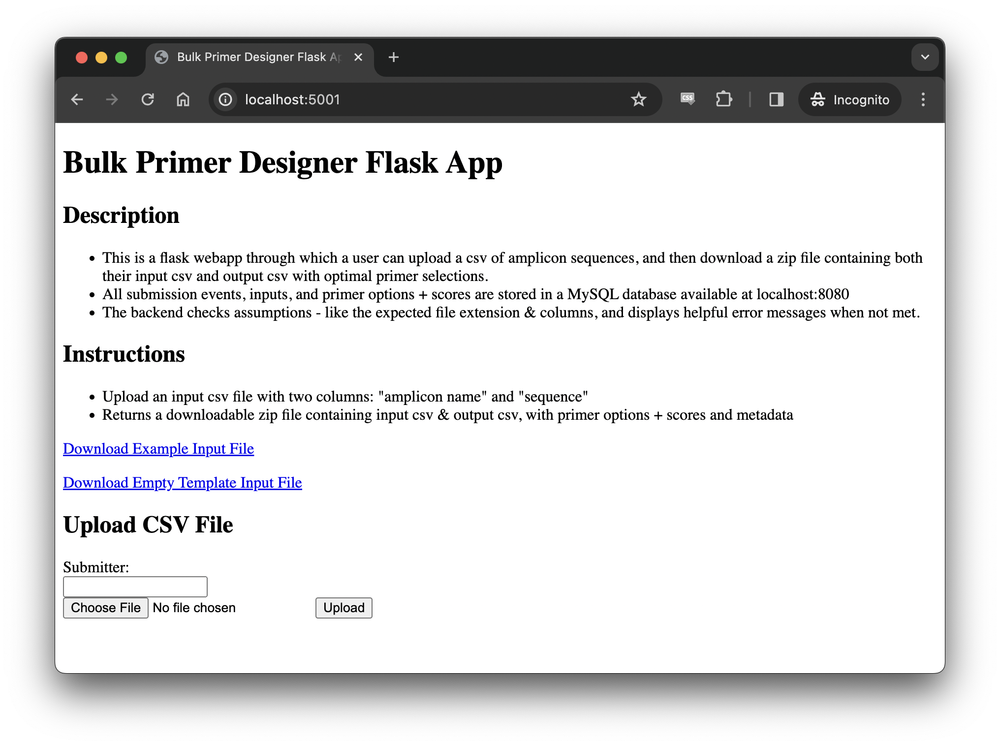
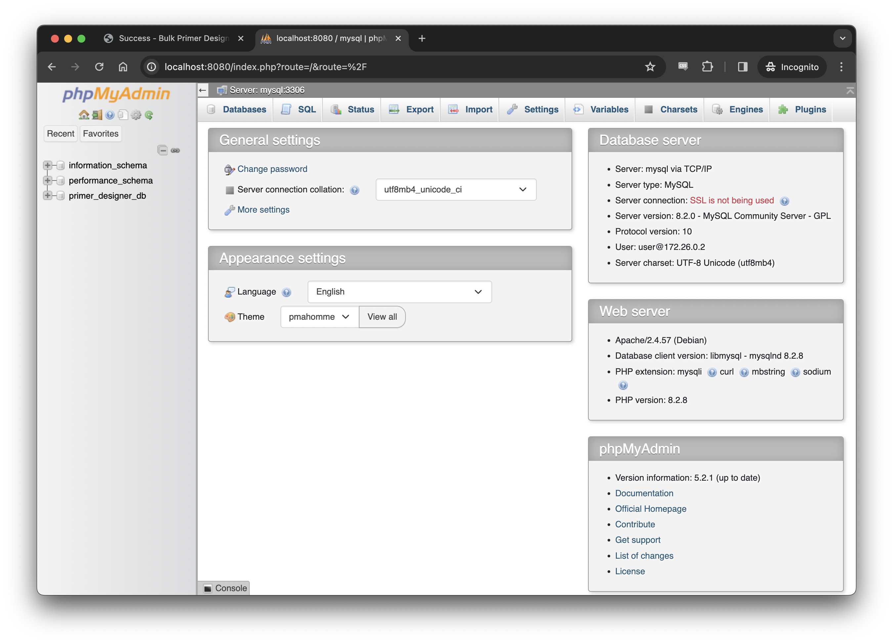

# Bulk Primer Designer for PCR Amplification, with MySQL Database Tracking
## Problem Statement
- In [metabolic engineering](https://en.wikipedia.org/wiki/Metabolic_engineering), optimizing biosynthetic pathways often involves comparing the performance of many [isozymes](https://en.wikipedia.org/wiki/Isozyme) for specific pathway reactions. This requires curating a list of genes, designing a unique set of [oligonucleotide primers](https://en.wikipedia.org/wiki/Primer_(molecular_biology)) for each, and using [PCR amplification](https://en.wikipedia.org/wiki/Polymerase_chain_reaction) to generate sufficient material for molecular cloning & strain engineering. 
- The primer design process can be time-consuming and repetitive, and it ultimately boils down to [a loose algorithm](https://www.addgene.org/protocols/primer-design/) involving calculation of biochemical properties and consideration of multiple constraints. This tool uses a simple [multi-criteria decision analysis (MCDA) approach](https://en.wikipedia.org/wiki/Weighted_sum_model) to automate primer design, saving time and reducing the manual design effort required for molecular cloning.
## Overview
- A containerized, full-stack webapp that designs oligonucleotide primers for PCR amplification of a list input of amplicon sequences.
    - For streamlined deployment, simply install Docker, download the source code, modify one local file for login credentials, and run the app with a single terminal command.

- The app features two web interfaces: one for uploading CSVs, viewing/download results, and triggering MySQL database tracking. The second interface serves as a database admin webpage for database management and running SQL queries. 
  
    - The app requires a two-column CSV file with headers 'amplicon name' and 'sequence' as input, and returns a zip file containing the input file, the scored list of all primer options considered, and the subsetted list of top-ranked optimal primers for each amplicon.
    - The MySQL data model contains 3 tables (submissions, amplicons, and primers_all_options), and 1 filtered view (optimal_primers)
        - See ```init.sql``` file for more details

### Skills Highlighted
- <b>Tech stack</b>: Docker (docker-compose & Dockerfile), Flask (python, pandas, Biopython, HTML, jinja, session), MySQL (database configuration with DDL, data loading with python mysql-connector, and querying with SQL)
- <b>Molecular biology</b>: Encoding a complex biological formula ([Modified Breslauer Melting Temperature](http://biotools.nubic.northwestern.edu/OligoCalc2.01.html)) into python, forward & reverse primer generation through multi-criteria decision analysis (MCDA) considering Tm, GC%, and presence or absence of a GC clamp
- <b>Best practices</b>: containerization & dependency management (docker-compse, Dockerfile, requirements.txt), secrets management (.env file), input validation (try/except), error handling (error.html with helpful error messages), comments & documentation (docstrings, inline comments, detailed README.md)
___
## Project File Structure
```
/bulk-primer-designer/
|-- /data/ (for example files, output zip files, and db files)
|   |-- (/mysql_data/) - not in repo, but automatically generated upon initialization
|   |-- empty_template_input_file.csv
|   |-- example_input_file.csv
|-- /readme_resources/ 
|   |-- various .png files referenced in README
|-- /webapp/
|   |-- /templates/
|       |-- error.html
|       |-- index.html
|       |-- success.html
|   |-- app.py
|   |-- Dockerfile
|   |-- load_database.py
|   |-- primer_designer.py
|   |-- requirements.txt
|-- .gitignore
|-- docker-compose.yml
|-- env.txt (MUST BE CHANGED TO .ENV LOCALLY; REPLACE DEFAULT VALUES)
|-- init.sql
|-- LICENSE
|-- README.md
```
___
## Requirements
1. Supported architectures: ```amd64```,  ```arm64v8```
1. Ensure Docker is installed - follow OS-specific links to docker installation documentation
    - ```Docker Desktop``` recommended for [MacOS](https://docs.docker.com/desktop/install/mac-install/) & [Windows](https://docs.docker.com/desktop/install/windows-install/). 
    - virtual ```Docker Desktop``` (or ```Docker Engine``` & ```Docker Compose```) installed on 64-bit [Linux](https://docs.docker.com/desktop/install/linux-install/) should also work (but not yet tested). 
## Installation
1. Clone or download this repo to copy the required files & file structure locally
    - If github is configured locally, open a terminal window and run: ```git clone --depth 1 https://github.com/ron-yadin/bulk-primer-designer.git```
    - Alternatively, click green ```Code``` button >  ```Download ZIP```, then unzip the file locally
1. Convert the ```env.txt``` file into a configured ```.env``` file locally
    - rename the ```env.txt``` template file as  ```.env```, and replace the default user name, passwords, database name, and flask secret key with custom secret values
    - this is a security best practice to avoid publication of sensitive login information - the ```.env``` is in the ```.gitignore``` file, and will not be included in version control
## Usage
1. Ensure Docker daemon is running locally (by starting Docker Desktop, for example)
    - Can verify by running ```docker run hello-world``` in a terminal window and confirming "Hello from Docker!" message displayed.
1. Open a terminal window
1. Navigate to the project folder using ```cd local/path/to/bulk-primer-designer```    
    - Update the path to match project folder location in local file system 
1. Run the command: ```docker-compose up --build```
    - Optionally, add the ```-d``` flag to run in "detached mode" (in the background)
    - The app takes ~20-40 seconds to initialize, perhaps longer upon the first use.
        - Typically this is how the final initialization line in the log looks, indicating the webapp is ready for use:  
        ```
        bulk-primer-designer-mysql-1 | 2023-12-31T20:22:02.531310Z 0 [System] [MY-010931] [Server] /usr/sbin/mysqld: ready for connections. Version: '8.2.0'  socket: '/var/run/mysqld/mysqld.sock'  port: 3306  MySQL Community Server - GPL.
        ```
1. Open a web browser and visit ```localhost:5001``` for the webapp user interface
    - There will be a description, instructions, links to download an example input file & empty input file template, and a form to submit an input csv and submitter name. 

    - Upon submission and successful execution, a redirect to the successful results display page will occur, with a link to download the output zip file

1. Open a web browser and visit ```localhost:8080``` for the MySQL database administration interface
    - use the user name (```MYSQL_USER```) & password (```MYSQL_PASSWORD```) configured in the ```.env``` file to sign into the MySQL admin dashboard


    - To inspect & query tables, click the database name (```MYSQL_DATABASE```) in the left panel. Tables will be shown and "SQL" option in the top navigation bar will open a box to enter queries
        - example SQL queries to run: 
        ```
        SELECT *
        FROM submissions s
        LEFT JOIN amplicons a on s.submission_id = a.submission_id
        LEFT JOIN optimal_primers op on a.amplicon_id = op.amplicon_id
        ```
        ```
        SELECT *
        FROM submissions s
        LEFT JOIN amplicons a on s.submission_id = a.submission_id
        LEFT JOIN primers_all_options pao on a.amplicon_id = pao.amplicon_id
        ```


1. To stop the app: 
    - if running in "streaming mode" (without the "detached mode" flag ```-d```), with the terminal window selected, press ```Ctrl+C```, followed by running the command ```docker-compose down -v```. 
    - If running in "detached mode", simply run the command ```docker-compose down -v``` in the terminal. 
    - Note: the data in the MySQL database persists between container restarts in a locally-mounted docker volume, automatically generating the /data/mysql_data directory
        - <b>IMPORTANT:</b> deleting the data/mysql_data/ directory will delete the data and reset the database upon re-initialization. 
___
## Notes
1. In addition to containing the data definition language (DDL) that configures the MySQL data model, the ```init.sql``` file includes the insertion of a few rows of example data upon initialization, to ensure the tables get created even in the absence of any user action. 
    - These lines can be removed if no example data is desired.
1. Successful submission and execution of the app generates a link to download the results zipfile, which is also saved to the /data/ directory. 
    - This results zip file contains the input file, the scored list of all primer options considered, and the subsetted list of top-ranked optimal primers for each amplicon
    - The filename is YYYY-MM-DD_HH:MM:SS_\<input_filename\>.zip 
1. All timestamps are localized to California time.
1. Input amplicon sequences are cleaned up after import - so "sequence" values are not case sensitive, and newline characters ("\n"), return characters ("\r"), and spaces will be removed (i.e. copy+paste from fasta file is OK)
## Primer Design Logic Explained
For each input amplicon sequence:
1. All 8 sequence options between 19 - 26 basepairs in length for both forward and reverse primers are [generated](https://github.com/ron-yadin/bulk-primer-designer/blob/324d8cba0c0c37ebfb4c4c1c5b5ed1cbadd1373b/webapp/primer_designer.py#L161)
1. Each option is [assessed for a GC clamp](https://github.com/ron-yadin/bulk-primer-designer/blob/324d8cba0c0c37ebfb4c4c1c5b5ed1cbadd1373b/webapp/primer_designer.py#L221) (terminal C or G), and assigned a binary GC clamp score of 0 or 1. 
1. [GC% is calculated](https://github.com/ron-yadin/bulk-primer-designer/blob/324d8cba0c0c37ebfb4c4c1c5b5ed1cbadd1373b/webapp/primer_designer.py#L230) for each primer option
1. [Melting temperature is calculated](https://github.com/ron-yadin/bulk-primer-designer/blob/324d8cba0c0c37ebfb4c4c1c5b5ed1cbadd1373b/webapp/primer_designer.py#L236C10-L236C10) for each primer option
1. The [distance between the primer option melting temperature the target melt temperature](https://github.com/ron-yadin/bulk-primer-designer/blob/324d8cba0c0c37ebfb4c4c1c5b5ed1cbadd1373b/webapp/primer_designer.py#L240) of 62°C is calculated
1. The [distance between the primer option GC% the target GC%](https://github.com/ron-yadin/bulk-primer-designer/blob/324d8cba0c0c37ebfb4c4c1c5b5ed1cbadd1373b/webapp/primer_designer.py#L241) of 50% is calculated
1. A [normalized melting temperature score & normalized GC% score](https://github.com/ron-yadin/bulk-primer-designer/blob/324d8cba0c0c37ebfb4c4c1c5b5ed1cbadd1373b/webapp/primer_designer.py#L265-L271) (between 0 -1) is calculated for each option, based on the range within each primer option group
1. The [total score is calculated](https://github.com/ron-yadin/bulk-primer-designer/blob/324d8cba0c0c37ebfb4c4c1c5b5ed1cbadd1373b/webapp/primer_designer.py#L273) by summing the GC clamp score, the normalized GC% score, and 2x the normalized melting temperature score (giving it a 2X weight, reflecting its importance for successful amplification)
1. The primer options are [given a rank](https://github.com/ron-yadin/bulk-primer-designer/blob/324d8cba0c0c37ebfb4c4c1c5b5ed1cbadd1373b/webapp/primer_designer.py#L285) based on their total score within each primer group - this dataframe is returned as the ```all_options_ranked_df```
1. [A filtered subset of all the rank #1 options is then created](https://github.com/ron-yadin/bulk-primer-designer/blob/324d8cba0c0c37ebfb4c4c1c5b5ed1cbadd1373b/webapp/primer_designer.py#L307) - this dataframe is returned as the ```optimal_primer_results_df```

___
## Troubleshooting
1. This error may appear if <b>Requirements</b> step  #1 was overlooked, and installation is attempted on an unsupported architecture
 ```
 no matching manifest for <non-supported/system/architecture> in the manifest list entries
 ```

2. This error may appear if <b>Installation</b> step  #2 was skipped or carried out incorrectly - ensure the ```env.txt``` file was converted successfully to a ```.env``` file, and is present in the project directory
```
Failed to load /Users/<username>/repos/bulk-primer-designer/.env: open /Users/<username>/repos/bulk-primer-designer/.env: no such file or directory
```
3. If issues arise in connecting to or executing actions with either user webapp or MySQL admin webapp, examine the container status & docker logs
    - In a new terminal window, run ```docker ps```. There should be 3 containers running

    - If running in "detached mode", run ```docker logs <container id>``` for each container - examine if any ```exited with error code #```. This would indicate an issue, and provide information for further troubleshooting.
    - If running in "streaming mode" (not detached), simply examine the logs in the terminal window for such error codes. 

## Known Limitations & Next Steps
1. This is an early-stage, example project designed for the purpose of demonstrating basic data engineering & molecular biology skills as a part of my public portfolio - <b>it has not been exhaustively tested, and there are certainly unhandled failure modes and error states that you may encounter while using. </b> 
    - While I plan to continue improving this tool's robustness (feel free to file issues on github if bugs are encountered!), please be advised that this is meant for demonstration purposes only.
    - The troubleshooting section is not comprehensive, and until further details can be added, it is recommended to enter any error messages encountered into google or a LLM chatbot for further troubleshooting assistance.
1. Future steps include:
    - Add more comprehensive input validation checks & appropriate error handling 
        - For instance: confirming that all input sequences are comprised of the 4 valid DNA bases
    - Developing a testing harness of unit & integration tests
    - Configuring a CI/CD pipeline to robustly protect the functional main branch
    - Using Terraform (or another Infrastructure as Code platform) to provision cloud services sufficient to host this webapp in the cloud, and make it securely availble over the open internet. 